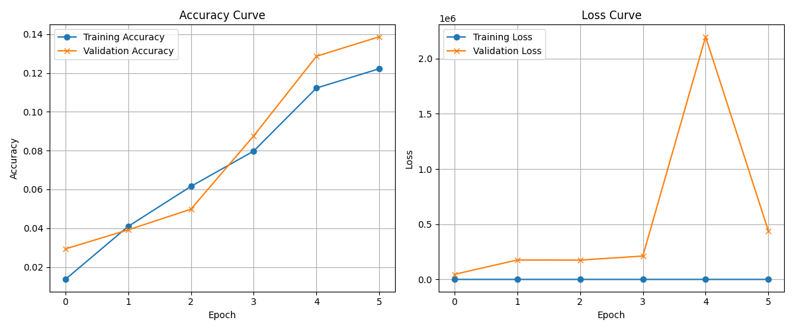

# 🖼️ Image Classification with AlexNet — 1,000+ Classes

[](https://python.org)
[](https://tensorflow.org)
[](https://keras.io)
[]()

> **Deep learning image classifier built from scratch using AlexNet architecture,
> trained on a custom dataset of 1,000+ categories.**
> Academic project — Data Science & AI, The Hashemite University, 2025.

---

## 📌 Project Overview

This project implements a **custom AlexNet-based CNN** to classify images across
**1,000+ distinct categories** using TensorFlow/Keras. The full pipeline covers:

- Custom `ImageDataGenerator` with augmentation (rotation, flip, zoom, brightness)
- AlexNet architecture rebuilt from scratch in Keras Sequential API
- Training with `EarlyStopping` and `ReduceLROnPlateau` callbacks
- Performance visualization (Accuracy & Loss curves)

---

## 🏗️ Model Architecture — AlexNet

```
Input (227×227×3)
    ↓
Conv2D(96, 11×11, stride=4) → ReLU → MaxPool → BatchNorm
    ↓
Conv2D(256, 5×5, same)      → ReLU → MaxPool → BatchNorm
    ↓
Conv2D(384, 3×3)            → ReLU → BatchNorm
    ↓
Conv2D(384, 3×3)            → ReLU → BatchNorm
    ↓
Conv2D(256, 3×3)            → ReLU → MaxPool → BatchNorm
    ↓
Flatten
    ↓
Dense(4096) → ReLU → Dropout(0.6) → BatchNorm
    ↓
Dense(4096) → ReLU → Dropout(0.6) → BatchNorm
    ↓
Dense(num_classes) → Softmax
```

**Total parameters**: ~57M (standard AlexNet scale)

---

## ⚙️ Training Configuration

| Parameter | Value |
|-----------|-------|
| Input size | 227 × 227 × 3 |
| Batch size | 32 |
| Optimizer | Adam (lr=0.001) |
| Loss | Categorical Crossentropy |
| Max Epochs | 25 |
| Early stopping patience | 5 |
| LR reduction factor | 0.2 (patience=3) |
| Validation split | 20% |

### Data Augmentation Applied
- Horizontal flip
- Rotation (±10°)
- Width/Height shift (10%)
- Zoom (15%)
- Brightness range [0.8, 1.2]

---

## 📊 Training Results

> ⚠️ **Note on results**: The model was trained for 6 epochs before early stopping.
> Accuracy is low (≈12%) due to the large number of classes (1,000+) combined
> with limited training data per class. See [Known Limitations](#-known-limitations)
> for full analysis and planned improvements.



| Metric | Training | Validation |
|--------|----------|------------|
| Accuracy (epoch 5) | ~12.1% | ~13.9% |
| Loss trend | Decreasing steadily | Unstable (spike at epoch 4) |

---

## 🗂️ Project Structure

```
image-classifier-alexnet/
├── alexnet.ipynb                    ← Main training notebook
├── training_metrics_plot.png        ← Accuracy & Loss curves
├── requirements.txt                 ← Dependencies
└── README.md
```

---

## 🚀 Quick Start

### 1. Clone the repository
```bash
git clone https://github.com/[your-username]/image-classifier-alexnet
cd image-classifier-alexnet
```

### 2. Install dependencies
```bash
pip install -r requirements.txt
```

### 3. Prepare your dataset
```
dataset/
├── class_1/
│   ├── img001.jpg
│   └── ...
├── class_2/
│   └── ...
└── class_N/
    └── ...
```

### 4. Update the data path in the notebook
```python
# Change this line to your dataset path
data_path = r'YOUR_DATASET_PATH_HERE'
```

### 5. Run the notebook
```bash
jupyter notebook 2239515.ipynb
```

---

## ⚠️ Known Limitations & Lessons Learned

This section documents the technical challenges encountered — an honest account
of what I learned through the process.

### 1. Low Accuracy (~12%)
**Root cause**: 1,000+ classes with limited samples per class.
Classic underfitting due to data scarcity in a large-scale classification task.

**What I learned**: For 1,000+ classes, you need either:
- Very large datasets (ImageNet uses 1.2M images, ~1,200/class)
- Or use **Transfer Learning** from a pretrained backbone (ResNet, EfficientNet)
  instead of training from scratch

**Planned fix**: Switch to `EfficientNetB0` pretrained on ImageNet,
freeze the base, fine-tune the top layers only.

### 2. Validation Loss Spike (Epoch 4)
**Observed**: Val Loss jumped from ~250K → ~2.1M at epoch 4, then dropped back.

**Root cause analysis**:
- Learning rate (0.001) may be too high for a deep network on noisy data
- `ReduceLROnPlateau` triggered but the spike had already occurred

**What I learned**: For large models, start with a lower LR (1e-4) and use
`CosineAnnealingLR` or a warmup schedule for more stable training.

### 3. Input Size Mismatch (Fixed in v2)
**Bug found**:
```python
# ImageDataGenerator was resizing to 224×224
target_size=(224, 224)

# But AlexNet input layer expected 227×227
input_shape=(227, 227, 3)
```
**Fix**: Aligned both to `227×227` — the standard AlexNet input size.

---

## 🔧 Improvements Planned (v2)

- [ ] Replace from-scratch AlexNet with pretrained `EfficientNetB0` (Transfer Learning)
- [ ] Add `class_weight` balancing for uneven class distribution
- [ ] Reduce learning rate to `1e-4` with warmup
- [ ] Add `ModelCheckpoint` to save best epoch only
- [ ] Add `classification_report` and `confusion_matrix` for per-class analysis
- [ ] Increase data per class or apply stronger augmentation for rare classes

---

## 🛠️ Tech Stack

- **Framework**: TensorFlow 2.x / Keras
- **Architecture**: AlexNet (custom implementation)
- **Language**: Python 3.10
- **Environment**: Jupyter Notebook / Google Colab

---

## 📬 Contact

**Albaraa Abdulmajeed Aljaber**
Data Science & AI Student — The Hashemite University

📧 [albaraaljaberwork@gmail.com]
💼 [https://www.linkedin.com/in/albara-aljaber/]
